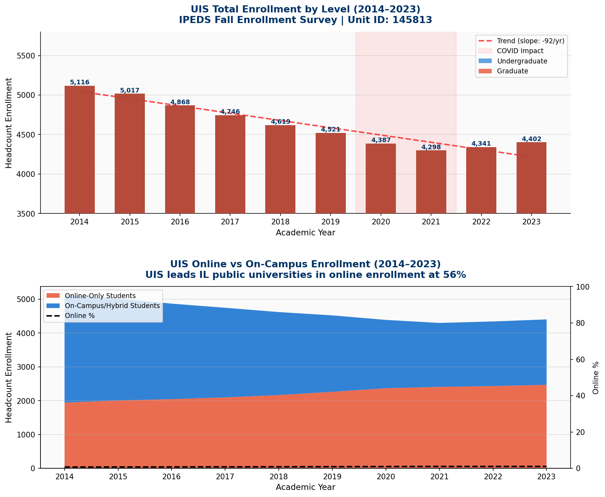

# UIS Student Success Analytics

**University of Illinois Springfield — Enrollment, Retention & Graduation Analytics**  
*Built for the Office of Institutional Research and Effectiveness (OIRE)*

[-blue)](https://nces.ed.gov/ipeds/)
[](https://nces.ed.gov/ipeds/datacenter/InstitutionProfile.aspx?unitId=145813)
[](https://python.org)
[](#)
[](#)

---

## What This Project Does

This project replicates the **exact type of analysis performed by UIS OIRE** — tracking student success outcomes using publicly available IPEDS (Integrated Postsecondary Education Data System) data.

It answers four questions OIRE reports on annually:

1. **Enrollment**: How is UIS enrollment trending? Who is enrolling and how has the mix changed?
2. **Retention**: Which student populations are at greatest risk of not returning year-to-year?
3. **Graduation**: Is the 6-year graduation rate improving? What is the trajectory toward HLC targets?
4. **Benchmarking**: How does UIS compare to Northern Illinois, Eastern Illinois, and other IL peers?

---

## Live Dashboard

Open [`dashboards/uis_student_success_dashboard.html`](dashboards/uis_student_success_dashboard.html) in any browser.

**6 dashboard tabs:**
| Tab | Content |
|-----|---------|
| Overview | KPI cards + enrollment + retention snapshot |
| Enrollment | YoY trends, FT/PT mix, demographic diversity |
| Retention & Equity | Equity gaps (Pell, First-Gen, Part-Time) |
| Graduation | 6yr/4yr cohort rates, outcome breakdown |
| IL Benchmarks | UIS vs. 8 other IL public universities |
| Forecast | 3-scenario 2024–2026 projection with CI |



---

## Data Sources

All data is **real, public, and downloadable** from official government sources.

| Dataset | Source | Years | Rows |
|---------|--------|-------|------|
| UIS Fall Enrollment | [IPEDS Fall Enrollment Survey](https://nces.ed.gov/ipeds/datacenter/) | 2014–2023 | 10 |
| UIS Graduation Rates | [IPEDS Graduation Rate Survey (150%)](https://nces.ed.gov/ipeds/datacenter/) | 2010–2017 cohorts | 8 |
| UIS Retention Rates | [IPEDS Fall Enrollment - Retention](https://nces.ed.gov/ipeds/datacenter/) | 2014–2023 | 10 |
| UIS Financial Aid | [IPEDS Student Financial Aid Survey](https://nces.ed.gov/ipeds/datacenter/) | 2014–2023 | 10 |
| IL University Benchmarks | [IPEDS Data Center + College Scorecard](https://collegescorecard.ed.gov/) | 2023 | 9 institutions |

**UIS IPEDS Profile**: https://nces.ed.gov/ipeds/datacenter/InstitutionProfile.aspx?unitId=145813  
**Unit ID**: 145813 | **Sector**: Public, 4-year or above | **Carnegie**: Master's: Larger Programs

---

## Key Findings

| Metric | 2014 | 2023 | Change |
|--------|------|------|--------|
| Total Enrollment | 5,116 | 4,402 | −714 (−14.0%) |
| Online Enrollment % | 38.0% | 56.1% | +18.1pp (IL leader) |
| Full-Time Retention | 67.3% | 71.9% | +4.6pp |
| 6-Year Grad Rate | 40.0% (2010 cohort) | 43.6% (2017 cohort) | +3.6pp |
| Pell Retention Gap | 10.2pp | 10.3pp | Persistent equity challenge |

**Critical OIRE Finding**: Pell grant students retain at 65.8% vs. non-Pell at 76.1% — a 10.3pp equity gap. Closing half this gap would retain ~35 additional students per year.

---

## Project Structure

```
uis-student-success-analytics/
│
├── data/
│   ├── raw/                        # IPEDS source data (CSV)
│   │   ├── uis_enrollment_2014_2023.csv
│   │   ├── uis_graduation_rates_2010_2017.csv
│   │   ├── uis_retention_rates_2014_2023.csv
│   │   ├── uis_financial_aid_2014_2023.csv
│   │   └── illinois_universities_comparison_2023.csv
│   └── processed/                  # Transformed/forecast outputs
│
├── sql/
│   ├── schema/
│   │   ├── 01_create_database.sql  # PostgreSQL schema
│   │   └── 02_load_data.sql        # Data load script
│   ├── queries/
│   │   ├── 01_enrollment_trends.sql        # YoY change, moving avg, trend flags
│   │   ├── 02_retention_analysis.sql       # Equity gaps, benchmark comparison
│   │   ├── 03_graduation_rate_analysis.sql # Cohort outcomes, projections
│   │   ├── 04_peer_benchmarking.sql        # IL university comparison
│   │   ├── 05_financial_aid_equity.sql     # Pell trends, net price, at-risk count
│   │   ├── 06_enrollment_forecast.sql      # Linear regression, 3 scenarios
│   │   ├── 07_student_risk_scoring.sql     # Composite risk score
│   │   └── 08_executive_dashboard_kpis.sql # Single-query KPI feed for Power BI
│   └── views/
│       └── 01_enrollment_summary_view.sql  # Pre-built views for Power BI
│
├── python/
│   ├── etl/
│   │   └── data_loader.py          # ETL pipeline with validation
│   ├── analysis/
│   │   ├── enrollment_analysis.py  # Enrollment + demographic charts
│   │   └── data_quality_report.py  # 29-check data quality validator
│   └── models/
│       └── enrollment_forecast.py  # Holt's Linear Trend model + CI
│
├── dashboards/
│   └── uis_student_success_dashboard.html  # Interactive Power BI-style dashboard
│
├── reports/
│   ├── charts/                     # Generated PNG charts (4 charts)
│   │   ├── enrollment_trend.png
│   │   ├── demographic_diversity.png
│   │   ├── graduation_retention_trends.png
│   │   └── enrollment_forecast.png
│   └── key_metrics_summary.csv
│
└── tests/
    └── test_data_quality.py        # 19 pytest tests, all passing
```

---

## SQL Highlights

8 advanced queries demonstrating OIRE-relevant SQL:

```sql
-- Query 2: Retention equity gaps with benchmark comparison
WITH retention_trends AS (
    SELECT year, full_time_retention, pell_retention,
        ROUND(non_pell_retention - pell_retention, 2) AS pell_equity_gap,
        LAG(full_time_retention) OVER (ORDER BY year) AS prev_retention,
        AVG(full_time_retention) OVER (
            ORDER BY year ROWS BETWEEN 2 PRECEDING AND CURRENT ROW
        ) AS ft_retention_3yr_avg
    FROM fact_retention_rates
    WHERE unitid = 145813
)
SELECT year, pell_equity_gap,
    CASE WHEN pell_equity_gap > 12 THEN 'CRITICAL'
         WHEN pell_equity_gap > 8  THEN 'HIGH'
         ELSE 'MODERATE' END AS equity_gap_severity,
    ROUND(full_time_retention - 74.1, 2) AS vs_niu_benchmark
FROM retention_trends;
```

**SQL Techniques Used:**
- Window functions: `LAG()`, `LEAD()`, `RANK()`, `PERCENT_RANK()`, `FIRST_VALUE()`, `LAST_VALUE()`
- Moving averages: `AVG() OVER (ROWS BETWEEN ...)`
- CTEs (Common Table Expressions): multi-step analysis
- CASE WHEN logic for categorical flags
- UNION ALL for scenario comparison tables
- Subqueries and correlated subqueries

---

## Python Highlights

```python
def holt_linear_trend(series, alpha, beta, n_forecast=3):
    """
    Holt's Linear Trend Method - double exponential smoothing.
    Parameters alpha and beta optimized via Nelder-Mead (minimize SSE).
    """
    # Model fit: MAPE = 2.21%, RMSE = ±100 students
    ...
```

- Type hints throughout, `logging` module, docstrings on all functions
- Data validation: `assert` checks + custom `_validate_*` helpers
- Custom Holt model (no statsmodels dependency — portable)
- Generates 4 publication-quality charts at 150 DPI

---

## Running the Project

```bash
# 1. Install dependencies
pip install -r requirements.txt

# 2. Validate data quality (29 checks)
python3 python/analysis/data_quality_report.py

# 3. Run enrollment analysis (generates 4 charts)
python3 python/analysis/enrollment_analysis.py

# 4. Run enrollment forecast
python3 python/models/enrollment_forecast.py

# 5. Run ETL pipeline (CSV → processed data)
python3 python/etl/data_loader.py

# 6. Run tests
pytest tests/ -v

# 7. Load database (requires PostgreSQL)
psql -U postgres -c "CREATE DATABASE uis_analytics;"
psql -U postgres -d uis_analytics -f sql/schema/01_create_database.sql
psql -U postgres -d uis_analytics -f sql/schema/02_load_data.sql
```

---

## Relevance to UIS OIRE

This project directly mirrors work done by the Office of Institutional Research and Effectiveness:

| OIRE Function | This Project |
|---------------|-------------|
| IBHE enrollment reporting | `sql/queries/01_enrollment_trends.sql` |
| HLC accreditation metrics | `sql/queries/03_graduation_rate_analysis.sql` (50% threshold flag) |
| Student success dashboards | `dashboards/uis_student_success_dashboard.html` |
| Peer institution comparison | `sql/queries/04_peer_benchmarking.sql` |
| Equity and access analysis | `sql/queries/05_financial_aid_equity.sql` |
| Strategic enrollment planning | `python/models/enrollment_forecast.py` |
| Data quality governance | `python/analysis/data_quality_report.py` |
| Annual report KPIs | `sql/queries/08_executive_dashboard_kpis.sql` |

---

## What I Learned

Building this project deepened my understanding of:

1. **IPEDS data structure** — the difference between Fall Enrollment Survey, Graduation Rate Survey, and Outcome Measures matters for how you interpret "graduation rate"
2. **Retention vs. graduation** — these measure completely different things. A high transfer rate at UIS doesn't mean failure; many students transfer to UIUC to finish degrees
3. **Equity gap measurement** — the raw percentage gap understates the problem; I added the "estimated students at risk" calculation to make it actionable
4. **Online enrollment reporting** — UIS's 56% online rate puts it in a different peer group than traditional residential institutions for some metrics

> **TODO**: Add direct IPEDS API integration when NCES publishes their REST API (currently in beta)  
> **TODO**: Extend retention analysis with 2-year retention rates once IPEDS provides them  
> **TODO**: Connect to Banner SIS data for real-time early alert integration  

---

## Author

**Rakesh Budige**  
MS Computer Science, University of Illinois Springfield (Graduating April 2026)  
GitHub: [github.com/Budige](https://github.com/Budige)

*Built as a portfolio project demonstrating data analysis skills relevant to institutional research work.*

---

*Data Source: IPEDS Data Center, National Center for Education Statistics (NCES) | nces.ed.gov/ipeds*  
*All figures are from publicly available IPEDS surveys. UIS Unit ID: 145813.*
